---
## Author
author:
  name: Перегудов Александр Вадимович
  degrees: DSc
  orcid: 0000-0002-0877-7063
  email: 1132239659@rudn.ru
  affiliation:
    - name: Российский университет дружбы народов
      country: Российская Федерация
      postal-code: 117198
      city: Москва
      address: ул. Миклухо-Маклая, д. 6

## Title
title: "Лабораторная работа № 1"
subtitle: "Имитационное моделирование"
license: "CC BY"
---

# Цель работы

Настроить начальный стенд для проведения последующих лабораторных работ.



# Задание

# Теоретическое введение

# Выполнение лабораторной работы

Создал репозиторий по шаблону и склонировал на локальную машину. ([рис. @fig:001, @fig:002, @fig:003])

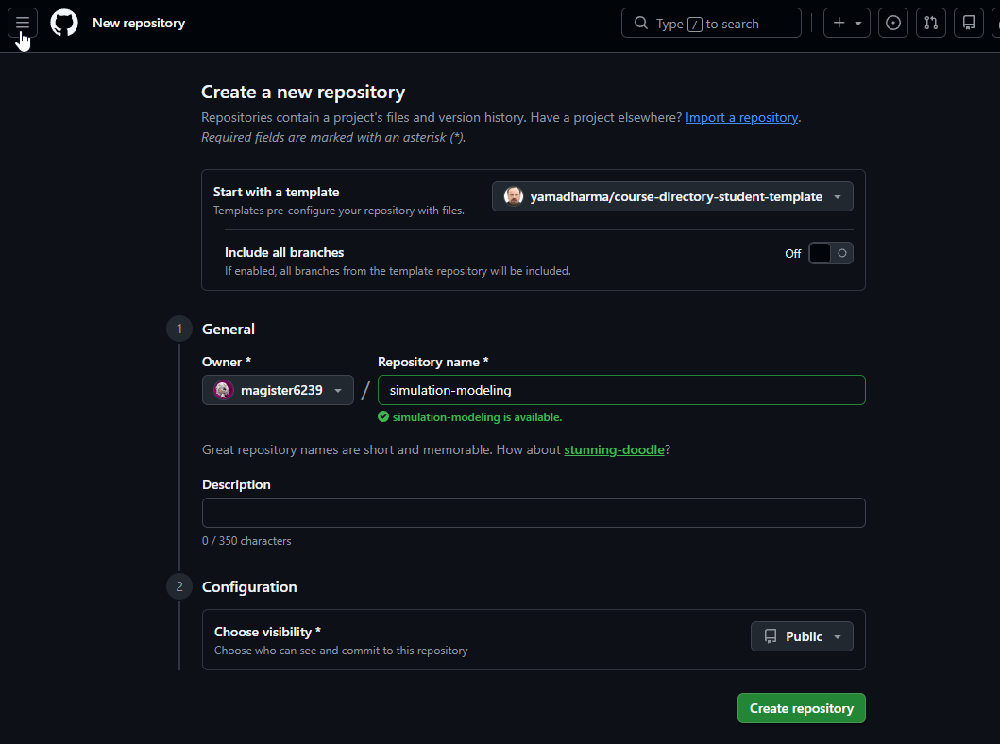{#fig:001 width=70%}

{#fig:002 width=70%}

{#fig:003 width=70%}

Инициализировал репозиторий на локальной машине и отправил на GitHub. ([рис. @fig:004, @fig:005, @fig:006])

{#fig:004 width=70%}

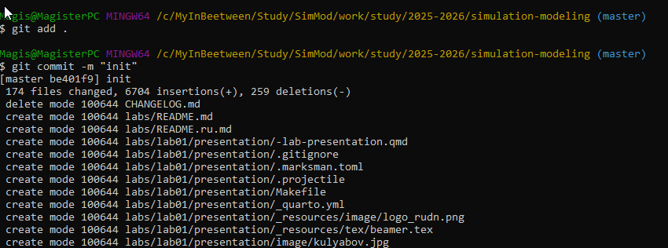{#fig:005 width=70%}

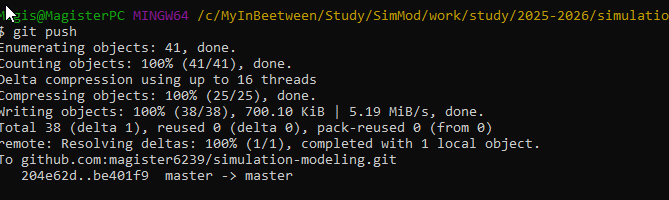{#fig:006 width=70%}

Настроил Git. ([рис. @fig:007])

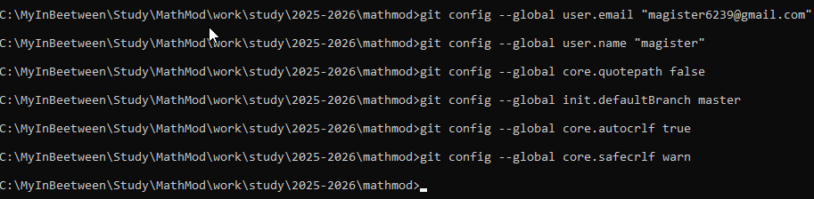{#fig:007 width=70%}

Создал GPG ключ и настроил Git используя его. ([рис. @fig:008, @fig:009, @fig:010, @fig:012, @fig:013, @fig:011])

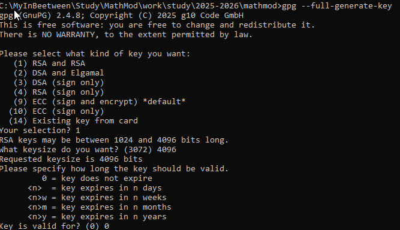{#fig:008 width=70%}

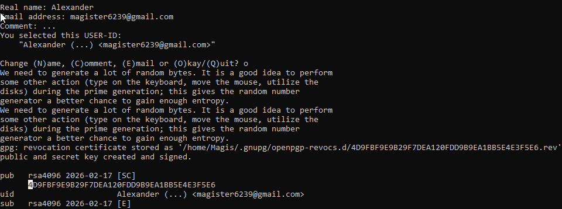{#fig:009 width=70%}

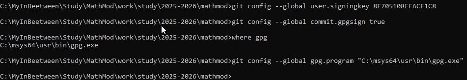{#fig:010 width=70%}

{#fig:012 width=70%}

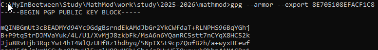{#fig:013 width=70%}

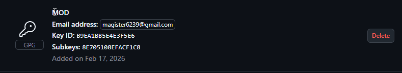{#fig:011 width=70%}

Проверил наличие git flow. ([рис. @fig:014])

{#fig:014 width=70%}

Настроил NodeJS. ([рис. @fig:015])

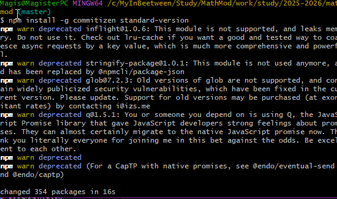{#fig:015 width=70%}

Инициализировал git flow и отправил изменения. ([рис. @fig:016, @fig:017])

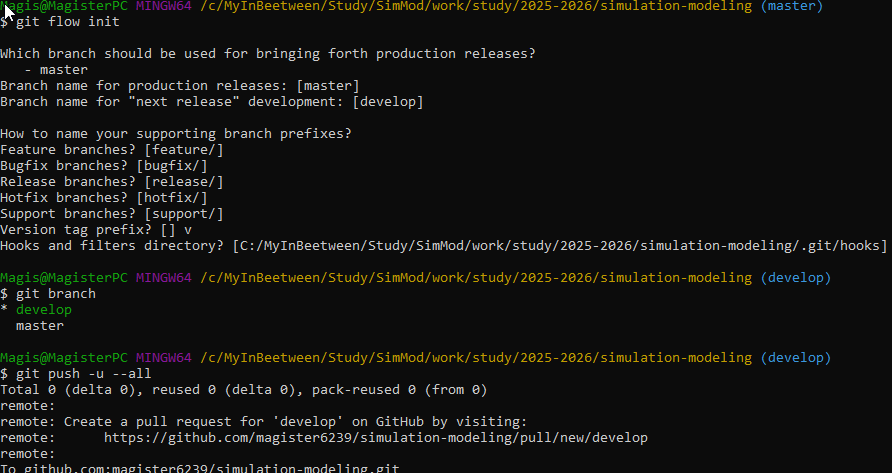{#fig:016 width=70%}

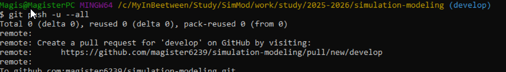{#fig:017 width=70%}

Проверил наличие Julia и Quatro. ([рис. @fig:018, @fig:019])

{#fig:018 width=70%}

{#fig:019 width=70%}

Инициализировал проект DrWatson. ([рис. @fig:022, @fig:025])

{#fig:022 width=70%}

{#fig:025 width=70%}

Установил необходимые пакеты. ([рис. @fig:020, @fig:021, @fig:023, @fig:024])

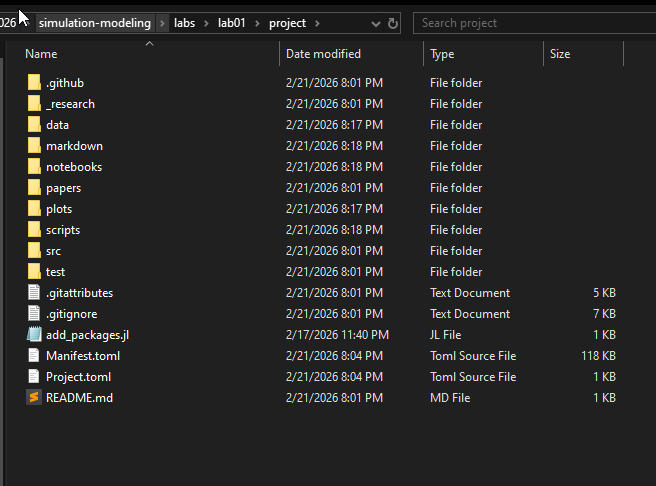{#fig:020 width=70%}

{#fig:021 width=70%}

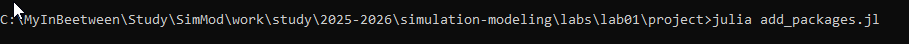{#fig:023 width=70%}

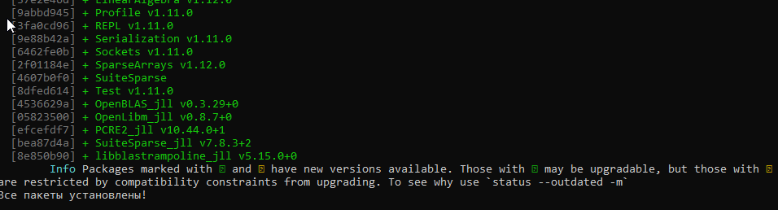{#fig:024 width=70%}

Создал скрипт test_setup и запустил его. ([рис. @fig:026, @fig:027, @fig:028])

{#fig:026 width=70%}

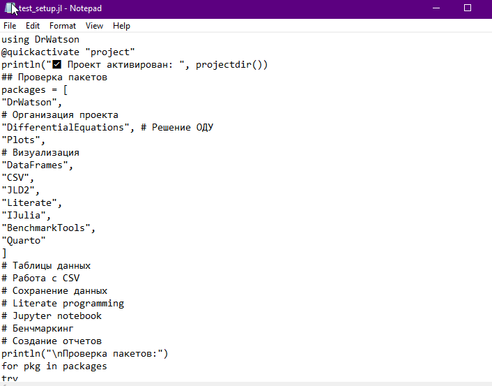{#fig:027 width=70%}

{#fig:028 width=70%}

Создал скрипт tangle и 01_exponential_growth запустил их. ([рис. @fig:030, @fig:029, @fig:031, @fig:032, @fig:033])

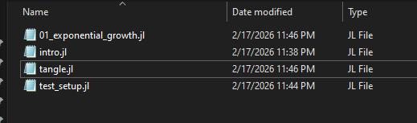{#fig:030 width=70%}

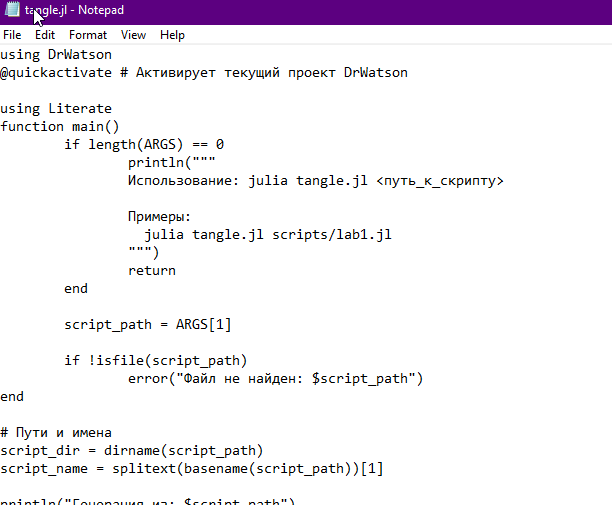{#fig:029 width=70%}

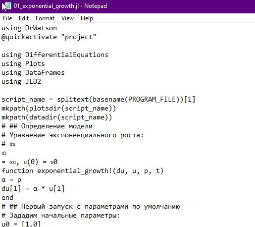{#fig:031 width=70%}

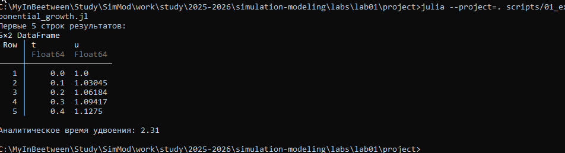{#fig:032 width=70%}

{#fig:033 width=70%}

Изменил конфигурация quarto для поддержки Julia в отчётах. ([рис. @fig:034])

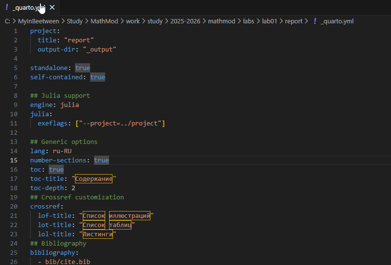{#fig:034 width=70%}

Создал скрипт 02_exponential_growth запустил его. ([рис. @fig:035, @fig:036, @fig:037, @fig:038, @fig:039])

{#fig:035 width=70%}

{#fig:036 width=70%}

{#fig:037 width=70%}

{#fig:038 width=70%}

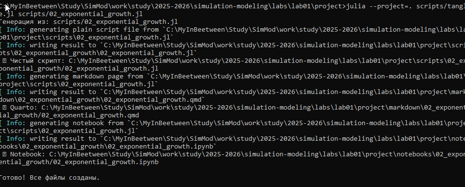{#fig:039 width=70%}
 
# Выводы

Стенд установлен и настроен.

# Список литературы{.unnumbered}

::: {#refs}
:::
