---
## Author
author:
  name: Перегудов Александр Вадимович
  degrees: DSc
  orcid: 0000-0002-0877-7063
  email: 1132239659@rudn.ru
  affiliation:
    - name: Российский университет дружбы народов
      country: Российская Федерация
      postal-code: 117198
      city: Москва
      address: ул. Миклухо-Маклая, д. 6

## Title
title: "Лабораторная работа № 4"
subtitle: "Имитационное моделирование"
license: "CC BY"
---

# Цель работы

Создать агентную модель распространения инфекционного заболевания на основе классической компартментальной модели SIR (Susceptible-Infectious-Recovered).








# Задание

# Теоретическое введение

# Выполнение лабораторной работы

Написал скрипт sir_run_basic.jl и запустил его. ([рис. @fig:010, @fig:011, @fig:012])

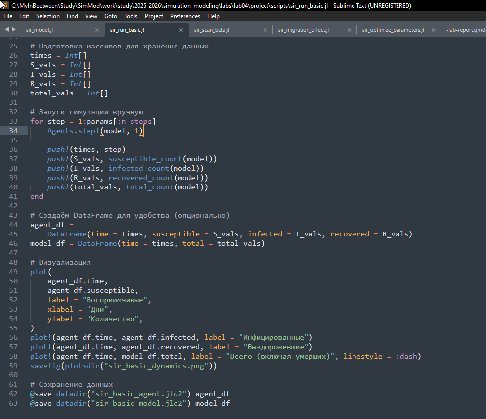{#fig:010 width=70%}

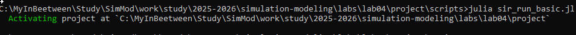{#fig:011 width=70%}

{#fig:012 width=70%}

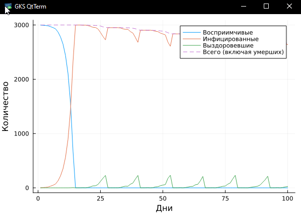{#fig:012 width=70%}

Написал базовый скрипт sir_model.jl для запуска одного эксперимента. ([рис. @fig:001])

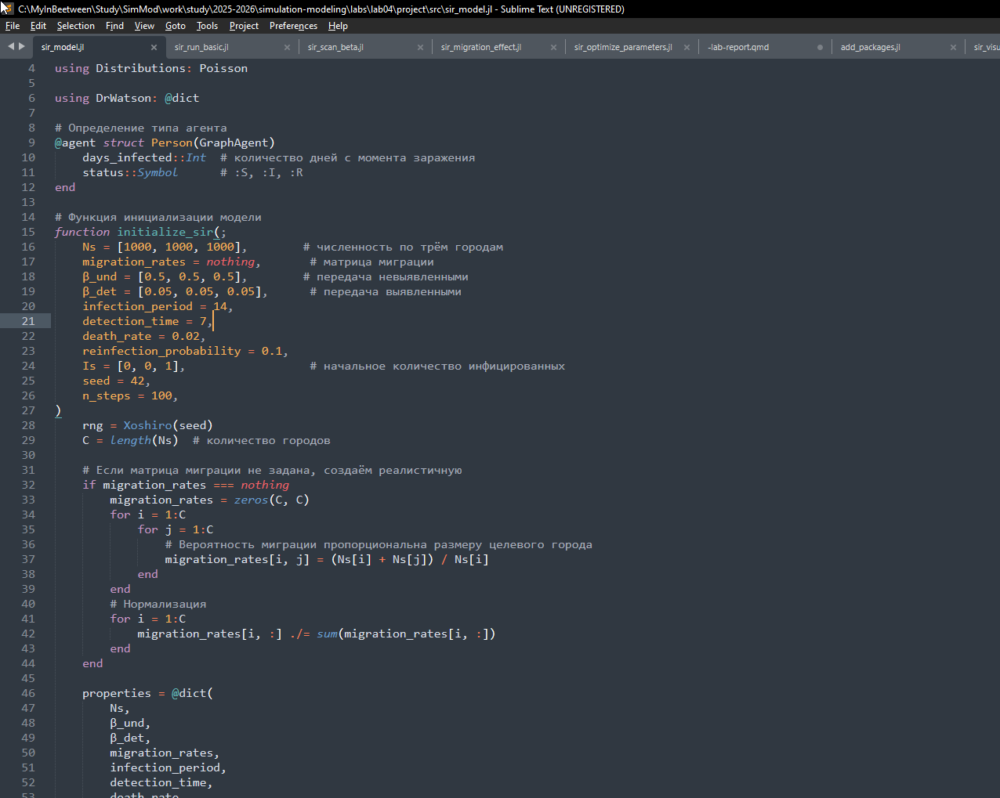{#fig:001 width=70%}

Написал скрипт sir_scan_beta.jl и запустил его. ([рис. @fig:002, @fig:003, @fig:004])

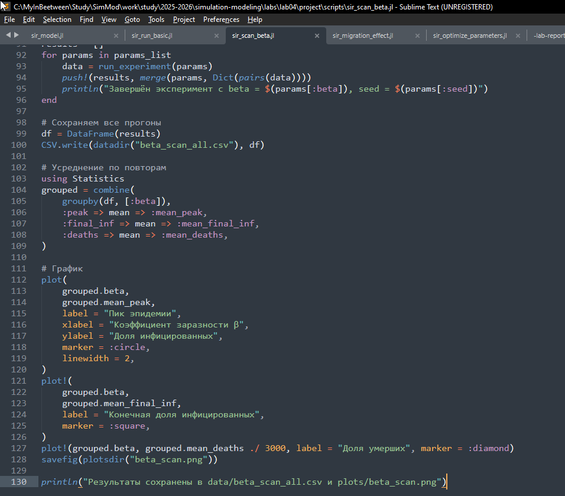{#fig:002 width=70%}

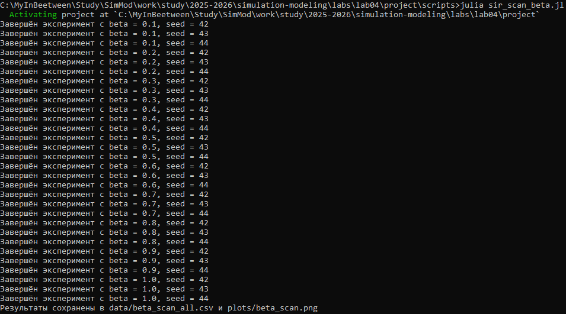{#fig:003 width=70%}

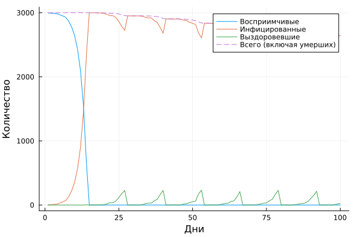{#fig:004 width=70%}

Написал скрипт sir_migration_effect.jl и запустил его. ([рис. @fig:005, @fig:006, @fig:007])

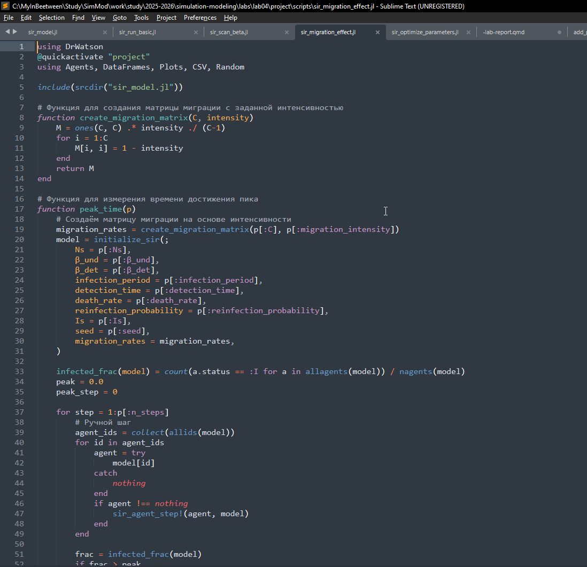{#fig:005 width=70%}

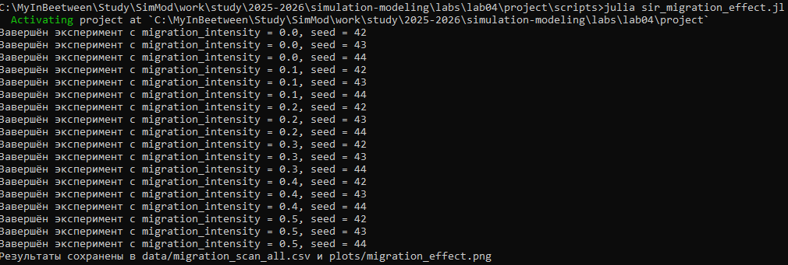{#fig:006 width=70%}

{#fig:007 width=70%}

Написал скрипт sir_optimize_parameters.jl и запустил его. ([рис. @fig:008, @fig:009])

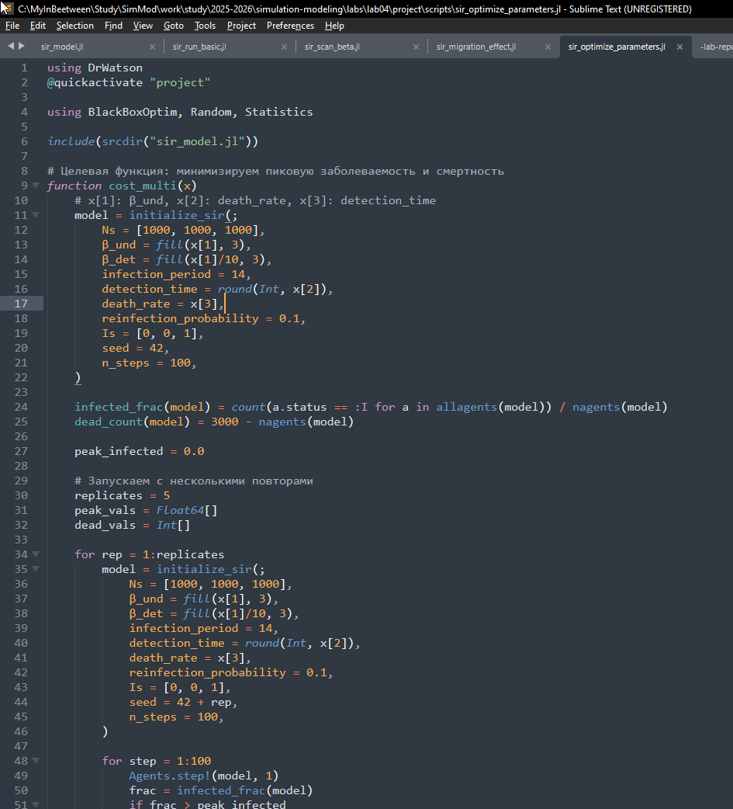{#fig:008 width=70%}

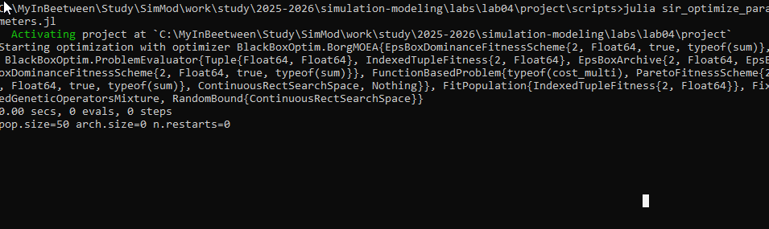{#fig:009 width=70%}

Написал скрипт sir_visualize_dynamics.jl и запустил его. ([рис. @fig:010, @fig:011, @fig:012])

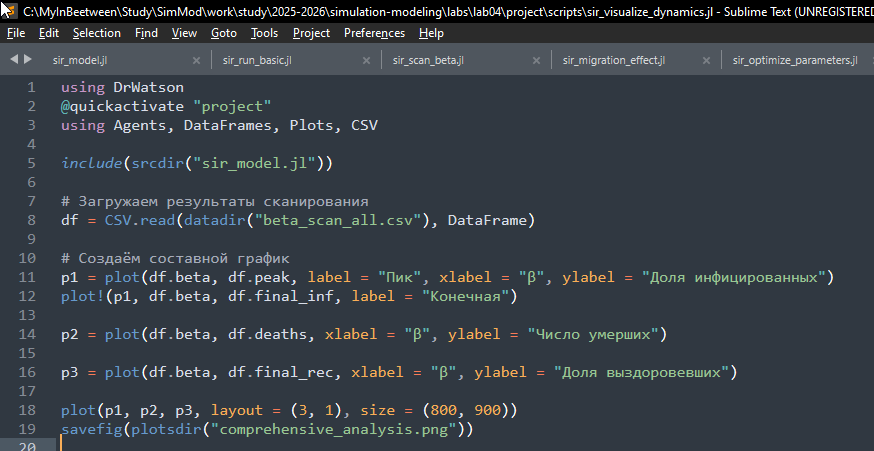{#fig:010 width=70%}

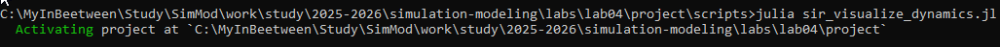{#fig:011 width=70%}

{#fig:012 width=70%}
 
# Выводы

Была создана агентная модель распространения инфекционного заболевания на основе классической компартментальной модели SIR.

# Список литературы{.unnumbered}

::: {#refs}
:::
