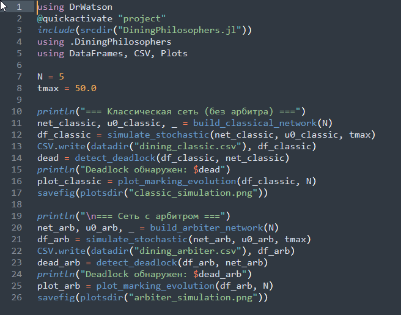
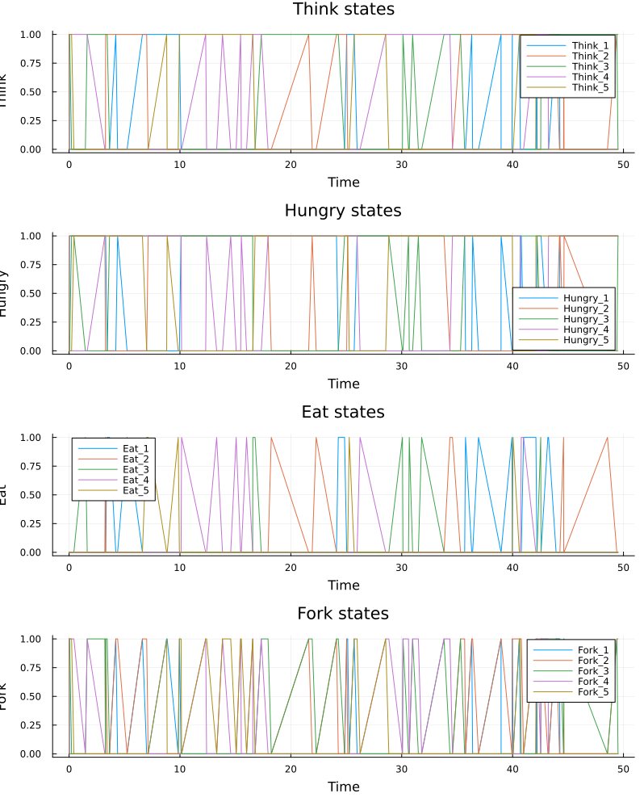
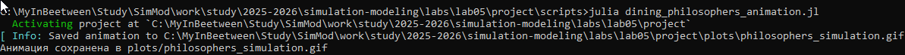
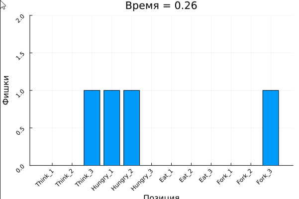

---
## Author
author:
  name: Перегудов Александр Вадимович
  degrees: DSc
  orcid: 0000-0002-0877-7063
  email: 1132239659@rudn.ru
  affiliation:
    - name: Российский университет дружбы народов
      country: Российская Федерация
      postal-code: 117198
      city: Москва
      address: ул. Миклухо-Маклая, д. 6

## Title
title: Лабораторная работа № 5
subtitle: Имитационное моделирование
license: CC BY
date: today
date-format: "YYYY-MM-DD" # Example: 2025-09-06
---

# Информация

## Докладчик

:::::::::::::: {.columns align=center}
::: {.column width="70%"}

  * Перегудов Александр Вадимович
  * Студент группы НФИбд-02-23
  * Российский университет дружбы народов им. П. Лумумбы
  * <https://github.com/magister6239/mathmod>

:::
::::::::::::::

# Вводная часть

## Актуальность

## Объект и предмет исследования

Julia, DrWatson

## Цели и задачи

Построить сеть Петри для пяти философов, моделируя захват и освобождение вилок.
Обнаружить состояние взаимной блокировки (deadlock), когда каждый философ взял одну вилку и ждёт вторую.
Провести имитационное моделирование (стохастическое и детерминированное) и выявить наличие deadlock.
Модифицировать сеть, чтобы предотвратить deadlock.
Проанализировать результаты и оформить отчёт с графиками и анимацией.

## Материалы и методы

- Процессор `pandoc` для входного формата Markdown
- Результирующие форматы
	- `pdf`
	- `html`
- Автоматизация процесса создания: `Makefile`

## Выполнение скриптов

{width=70%}

{width=70%}

{width=70%}

{width=70%}

{width=70%}

{width=70%}

{width=70%}

{width=70%}

{width=70%}

{width=70%}

{width=70%}
