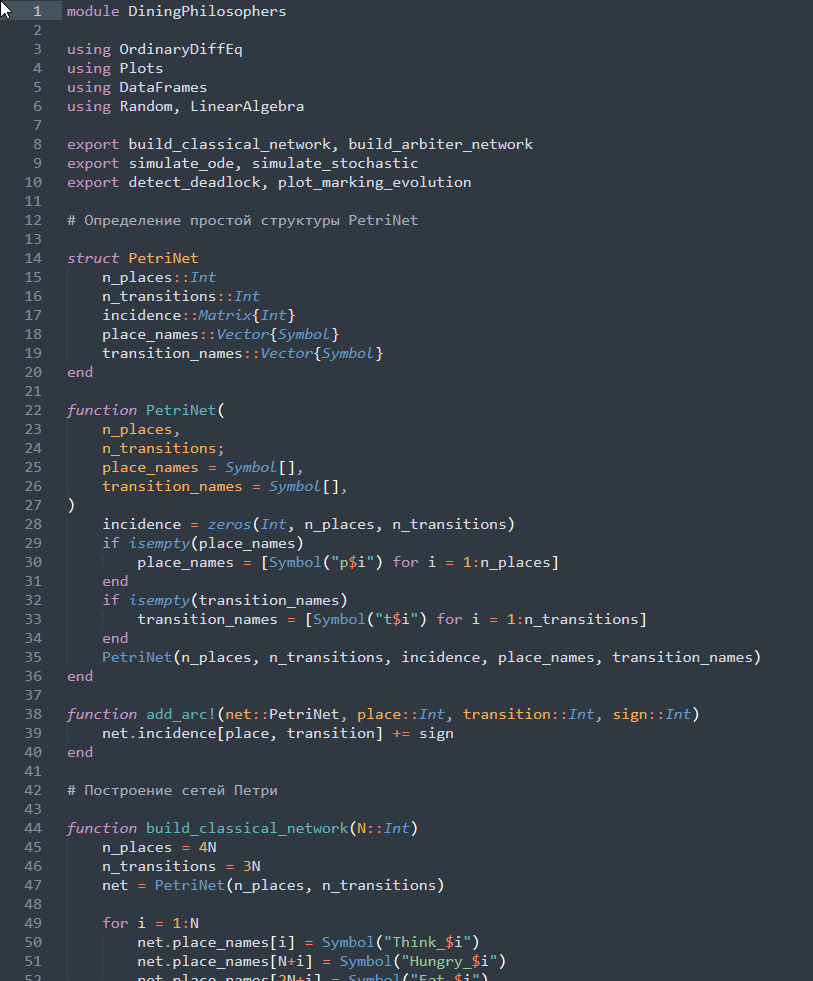
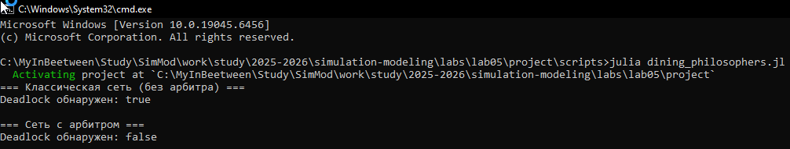
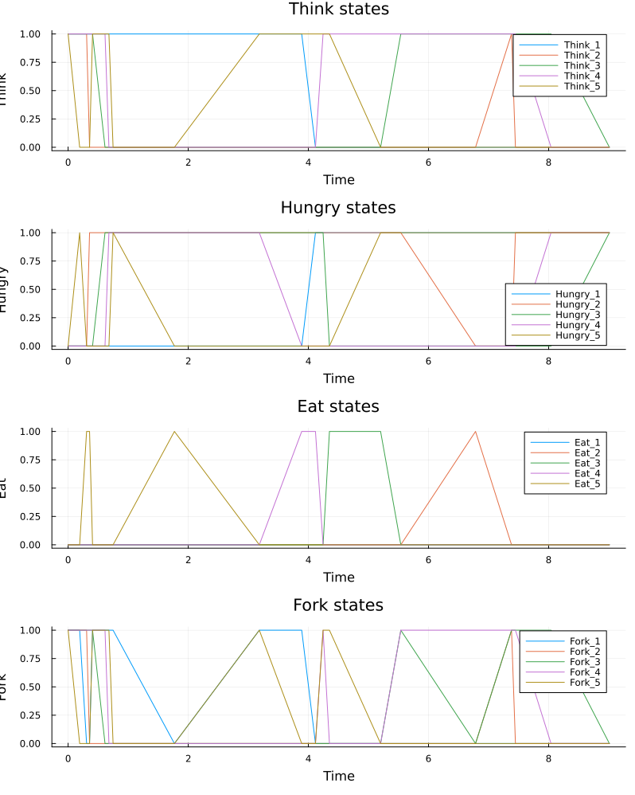
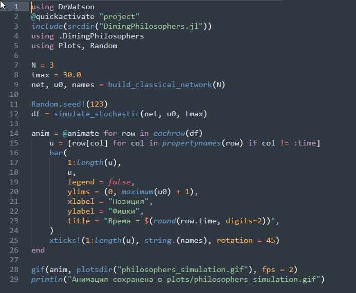
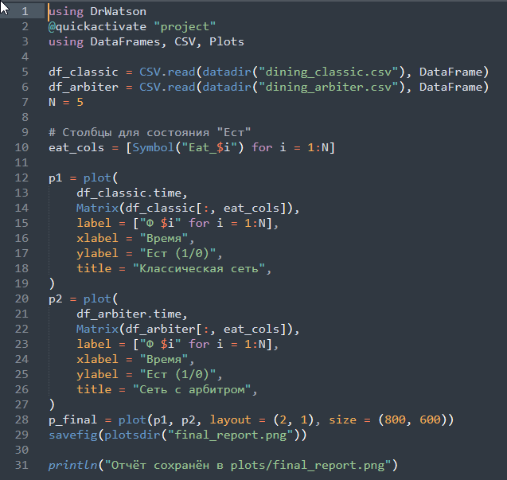
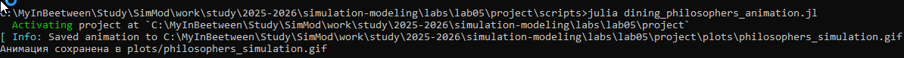
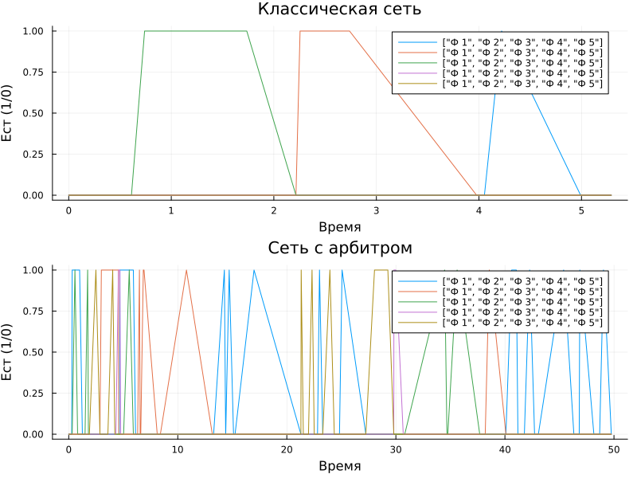

---
## Author
author:
  name: Перегудов Александр Вадимович
  degrees: DSc
  orcid: 0000-0002-0877-7063
  email: 1132239659@rudn.ru
  affiliation:
    - name: Российский университет дружбы народов
      country: Российская Федерация
      postal-code: 117198
      city: Москва
      address: ул. Миклухо-Маклая, д. 6

## Title
title: "Лабораторная работа № 5"
subtitle: "Имитационное моделирование"
license: "CC BY"
---

# Цель работы

Построить сеть Петри для пяти философов, моделируя захват и освобождение вилок.
Обнаружить состояние взаимной блокировки (deadlock), когда каждый философ взял одну вилку и ждёт вторую.
Провести имитационное моделирование (стохастическое и детерминированное) и выявить наличие deadlock.
Модифицировать сеть, чтобы предотвратить deadlock.
Проанализировать результаты и оформить отчёт с графиками и анимацией.






# Задание

# Теоретическое введение

# Выполнение лабораторной работы

Написал скрипт базовый скрипт DiningPhilosophers.jl. ([рис. @fig:001])

{#fig:001 width=70%}

Написал скрипт dining_philosophers.jl и запустил его. ([рис. @fig:002, @fig:003, @fig:004, @fig:005])

{#fig:002 width=70%}

{#fig:003 width=70%}

{#fig:004 width=70%}

{#fig:005 width=70%}

Написал скрипт dining_philosophers_animation.jl и запустил его. ([рис. @fig:006, @fig:007, @fig:008])

{#fig:006 width=70%}

{#fig:007 width=70%}

{#fig:008 width=70%}

Написал скрипт dining_philosophers_report.jl и запустил его. ([рис. @fig:009, @fig:010, @fig:011])

{#fig:009 width=70%}

{#fig:010 width=70%}

{#fig:011 width=70%}
 
# Выводы

Была построена сеть Петри для пяти философов. Были проанализированы два варианта сети Петри: классическая и с арбитром.

# Список литературы{.unnumbered}

::: {#refs}
:::
