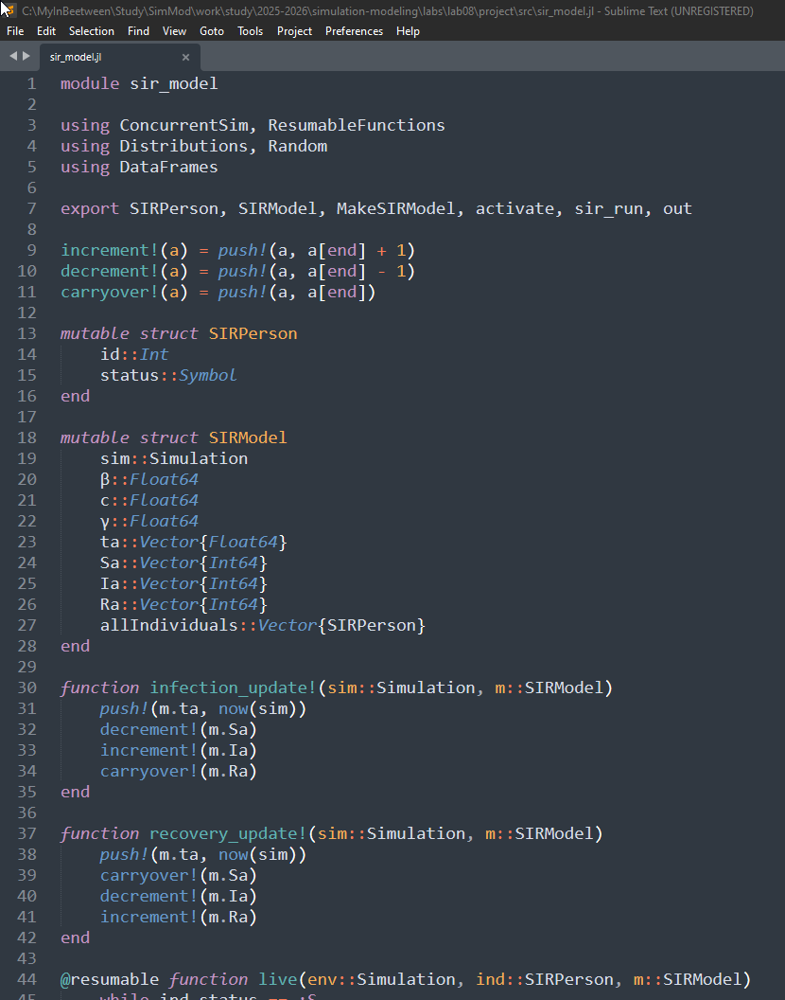
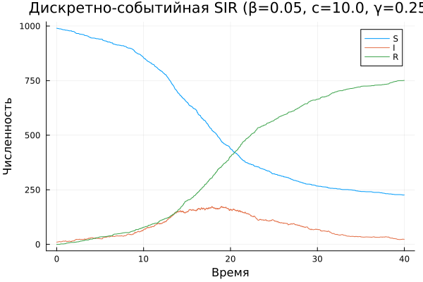
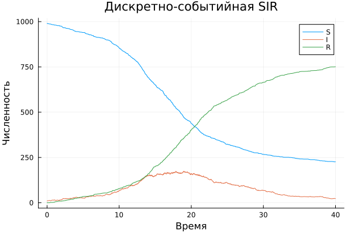

---
## Author
author:
  name: Перегудов Александр Вадимович
  degrees: DSc
  orcid: 0000-0002-0877-7063
  email: 1132239659@rudn.ru
  affiliation:
    - name: Российский университет дружбы народов
      country: Российская Федерация
      postal-code: 117198
      city: Москва
      address: ул. Миклухо-Маклая, д. 6

## Title
title: "Лабораторная работа № 8"
subtitle: "Имитационное моделирование"
license: "CC BY"
---

# Цель работы

Изучить дискретно-событийный подход к имитационному моделированию на
примере классической модели распространения инфекции SIR. Реализовать стохастическую дискретно-событийную модель в виде программного комплекса на
языке Julia. Провести анализ влияния параметров, сравнить со стохастической и
детерминированной версиями, оценить производительность и модифицировать
модель.




# Задание

# Теоретическое введение

# Выполнение лабораторной работы

Написал скрипт базовый скрипт sir_model.jl. ([рис. @fig:001])

{#fig:001 width=70%}

Написал скрипт sir_des.jl и запустил его. ([рис. @fig:002, @fig:003, @fig:004, @fig:005, @fig:006, @fig:007, @fig:008])

{#fig:002 width=70%}

{#fig:003 width=70%}

{#fig:004 width=70%}

{#fig:005 width=70%}

{#fig:006 width=70%}

{#fig:007 width=70%}

{#fig:008 width=70%}
 
# Выводы

Был изучен дискретно-событийный подход к имитационному моделированию на
примере классической модели распространения инфекции SIR.

# Список литературы{.unnumbered}

::: {#refs}
:::
